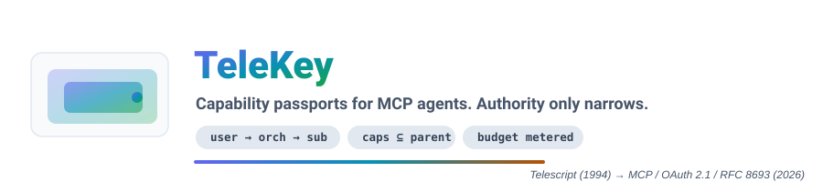
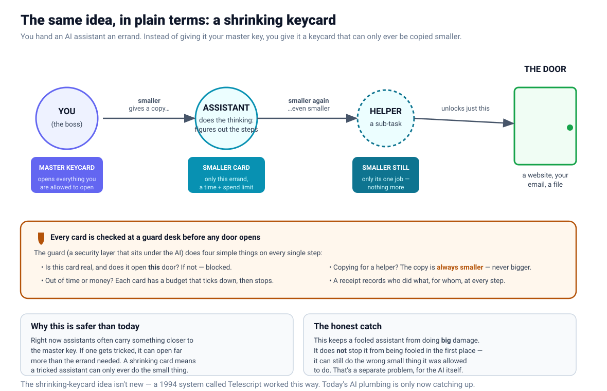
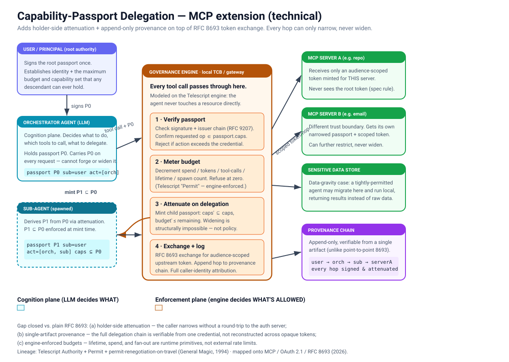

<!-- Hero banner: a theme-aware SVG. The colored heading is a gradient rendered
     INSIDE the SVG, so GitHub's Markdown sanitizer (which strips <style> from
     inline HTML) can't touch it, and it reads on both light and dark themes. -->
<p align="center">
  
</p>

<!-- One row of functional badges. Consensus in 2026: 3–6 badges, each linking
     to a real signal. -->
<p align="center">
  <a href="https://github.com/stefans71/telekey-mcp/actions/workflows/ci.yml"></a>
  <a href="https://modelcontextprotocol.io"></a>
  <a href="https://datatracker.ietf.org/doc/html/rfc8693"></a>
  =22">
  <a href="#license"></a>
</p>

<p align="center">
  <b>TeleKey — a reference MCP gateway where an agent's authority can only ever shrink as it delegates.</b><br>
  <sub>Ports Telescript's 1994 permit model onto the modern agent stack — as an extension, not a rewrite.</sub>
</p>

---

## The one-sentence version

An AI assistant gets a **capability passport**, not your master key — and every time it hands work to a sub-agent or crosses a server boundary, the passport can only be copied **smaller**. Widening isn't forbidden by policy; it produces a credential that fails verification.

<p align="center">
  
</p>

> [!NOTE]
> This is **enforcement**, not cognition. It bounds what a compromised or prompt-injected agent *can* do. It does **not** stop the agent from being fooled into misusing what it legitimately holds — that's a separate, cognition-plane problem. Keeping the two apart is the whole design.

## Why this exists

The delegation primitive the MCP spec now leans on ([RFC 8693 token exchange](https://datatracker.ietf.org/doc/html/rfc8693)) has three documented gaps: no holder-side scope attenuation, no portable provenance across hops, and no cross-domain verification without pre-arranged federation. The first — *the holder can't hand out a smaller credential on its own* — is exactly the property a 1994 language called **Telescript** enforced with its `Permit` model. This repo specifies and demonstrates that missing property as claims + one verification rule on top of standards everyone already ships.

## Why the name

In 1992, a startup called **General Magic** — the team that later seeded the iPhone, Android, eBay, and WebKit — built a language named **Telescript** for mobile software *agents*. Its core idea was a `Permit`: an unforgeable credential that travelled with an agent and, crucially, could **only be narrowed** as the agent moved between machines. The company folded; the idea was thirty years early.

The 2026 agent stack is now reinventing exactly that permit, badly, under names like "delegation token." **TeleKey** picks the idea back up — a *key* that shrinks as it's passed along, carrying its lineage in the name. Old idea, finally on time.

## How it works

<p align="center">
  
</p>

Every tool call routes through a governance **engine** — a local trusted computing base — that does four things:

| Step | Action | Telescript ancestor |
|:---:|---|---|
| **1** | **Verify** — check signature + parent-hash chain; confirm the requested op is in `caps` | `Authority` |
| **2** | **Meter** — decrement `spend` / `tool_calls` / `ttl` / `spawns`; refuse at zero | `Permit` allowances |
| **3** | **Attenuate** — on delegation, mint a child where `caps ⊆ parent` and `budget ≤ remaining` | permit renegotiation on travel |
| **4** | **Log** — RFC 8693 exchange for an audience-scoped upstream token; append the hop to provenance | four caller identities |

### The one rule that does the work

> [!IMPORTANT]
> A child passport is valid **only if** `caps ⊆ parent.caps` **and** every budget counter `≤` the parent's remaining budget.
> Widening produces an object that fails verification — it is *unrepresentable*, not merely refused.

## Quick start

```bash
npm install
npm test        # 9 fixtures, each a documented 2026 failure mode → asserted unrepresentable
node drive.js   # boots the real MCP server, runs a valid call + a denied injected call
```

Open it in the official **[MCP Inspector](https://github.com/modelcontextprotocol/inspector)**:

```bash
npx @modelcontextprotocol/inspector node src/server.js
```

Then call `delete_file` with a `passport` argument and watch the engine allow it — or try an ungranted capability and watch it return `isError` with a `CAP_NOT_GRANTED` code.

## Running the fixtures

Each test turns an OWASP MCP Top 10 / NSA-2026 failure mode into a pass/fail assertion:

| # | Fixture | Failure mode it closes |
|:---:|---|---|
| 1–2 | caps can't widen; scoped can't become wildcard | confused deputy · privilege escalation |
| 3 | legal narrowing drops unneeded caps | least privilege |
| 4 | budget can't widen | resource abuse |
| 5 | engine denies ungranted call | missing per-action authz |
| 6–7 | budget & spawn counters refuse at zero | runaway cost · fan-out |
| 8 | tampered passport fails signature | forgery · replay |
| 9 | single-artifact provenance chain | lost "who is this for" |

```console
# tests 9
# pass 9
# fail 0
```

## What's in here

```
src/          passport core: passport.js · engine.js · policy.js · publisher.js · server.js
plugin/       Claude Code plugin — PreToolUse hook enforcing the passport (also works on Codex/DeepSeek)
test/         conformance + policy fixtures (16 tests)
docs/         wizards (START-HERE, INSTALL-PLUGIN) + ROADMAP + NAMING
assets/       banner + diagrams (theme-aware SVG)
passport-policy.json   user-adjustable permission settings
drive.js      scripted JSON-RPC driver over stdio
```

Repo layout follows Git conventions: `README` + `LICENSE` at root, everything else namespaced. The plugin lives in `plugin/` and imports the shared core from `src/`, so it can be extracted to its own repo later without a rewrite.

<details>
<summary><b>Worked example — "clean up my old files, then email me a summary"</b></summary>

<br>

1. You approve once. Root passport **P0**: `caps = {listRepo, deleteFile:repoX, sendEmail:you}`, `budget = {ttl:120s, spend:$0.50, calls:40, spawns:2}`.
2. The orchestrator spawns a cleanup helper. The engine mints **P1 ⊆ P0** with `sendEmail` **dropped** — the helper has no business emailing.
3. The helper deletes files; each call is checked against `P1.caps`, budget ticks down, and a token scoped only to `repoX` is exchanged per call. The root token is never passed through.
4. Control returns; the orchestrator sends the summary under P0 (the helper never could).

If step 2's helper is prompt-injected into `sendEmail:attacker`, verification fails at step 1 — that capability was never in P1, and P1 could not have been widened to add it. **The injection still happened; it just had nowhere to go.**

</details>

## Status & caveats

> [!WARNING]
> Reference implementation, not production. HMAC signing here is a self-contained stand-in for real signed JWTs (RFC 9068, asymmetric keys) — the **verification logic**, not the crypto, is the standardizable part. The MCP project has **no official conformance suite yet** (it's on the 2026 roadmap); these fixtures are written against the real SDK so they can be pointed at that suite when it lands.

## Lineage & sources

Telescript Language Reference and Safety & Security whitepapers (General Magic, 1995) · [MCP authorization spec](https://modelcontextprotocol.io/specification/draft/basic/authorization) (2025–2026) · RFC 8693 / 8707 / 9068 / 9207 · NSA/CISA *MCP Security Design Considerations* (2026) · OWASP MCP Top 10.

## Project docs

| Doc | What it covers |
|---|---|
| [`START-HERE.md`](docs/START-HERE.md) | Interactive setup wizard for Claude Code — installs on a VPS + pushes to GitHub. |
| [`INSTALL-PLUGIN.md`](docs/INSTALL-PLUGIN.md) | Interactive wizard to install the enforcement plugin into Claude Code / Codex / DeepSeek. |
| [`ROADMAP.md`](docs/ROADMAP.md) | Product roadmap + go-to-market, positioned against macaroons / DeepMind DCTs / AIP. |
| [`NAMING.md`](docs/NAMING.md) | Name candidates + availability findings (why not "passport" in the name). |

## License

MIT.
