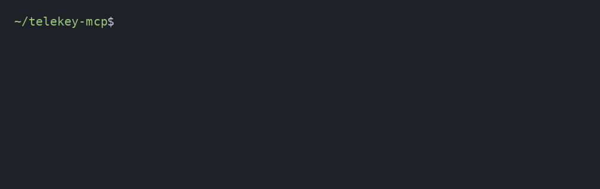

<!-- Hero banner: a theme-aware SVG. The colored heading is a gradient rendered
     INSIDE the SVG, so GitHub's Markdown sanitizer (which strips <style> from
     inline HTML) can't touch it, and it reads on both light and dark themes. -->
<p align="center">
  
</p>

<p align="center">
  <a href="https://github.com/stefans71/telekey-mcp/actions/workflows/ci.yml"></a>
  <a href="https://modelcontextprotocol.io"></a>
  <a href="https://datatracker.ietf.org/doc/html/rfc8693"></a>
  =22">
  <a href="#license"></a>
</p>

<p align="center">
  <b>Give every MCP agent a key scoped to one job — one that can only ever get narrower, never wider.</b><br>
  <sub>When an agent is prompt-injected, the capability it reaches for was never in its key. The attack has nowhere to go.</sub>
</p>

---

## See it stop an attack (30 seconds)

An agent is told to *"clean up my old files, then email me a summary."* You approve once. The orchestrator hands the cleanup to a helper — with a **narrowed key that drops `sendEmail`**. Then the helper gets prompt-injected into emailing an attacker:

<p align="center">
  
</p>

```bash
npm install
node demo.js    # the attack, against the passport API directly
node drive.js   # the same attack, over real stdio JSON-RPC against src/server.js
```

<sub>(Recording above is <code>assets/demo.gif</code>; the raw asciinema capture is <code>assets/demo.cast</code>.)</sub>

The injection still happened. It just had **nowhere to go** — `sendEmail` was never in the helper's key, and the key could not be widened to add it. That last line is the whole point: a wider key doesn't get *refused*, it **cannot be built**.

> [!NOTE]
> **It limits the damage — it doesn't prevent the compromise.** A scoped key bounds what a hijacked agent can reach; it doesn't stop the hijack. Blocking the manipulation itself has to happen upstream. TeleKey does the first job well and makes no claim on the second.

## Install into Claude Code (one command)

This repo *is* a plugin marketplace. Point Claude Code at it and install — no clone, no build:

```
/plugin marketplace add stefans71/telekey-mcp
/plugin install telekey
```

The `PreToolUse` hook now enforces the key on every tool call. The same hook contract works on Codex and DeepSeek's bridge. To try the mechanics without installing anything, use `node demo.js` above.

## The one rule that does the work

> [!IMPORTANT]
> A child key is valid **only if** `caps ⊆ parent.caps` **and** every budget counter `≤` the parent's remaining budget.
> Widening produces an object that fails verification — it is **unrepresentable**, not merely refused.

In the code this key is a signed **capability passport**; "key" and "passport" are the same thing throughout. Everything else — the engine, the policy layer, the plugin — exists to enforce that one rule at every hop.

## What it stops

Twenty-five fixtures, each turning a documented 2026 agent-security failure mode into a pass/fail assertion. Every line below is backed by a passing test in [`test/`](test/) — run `npm test` to see them go green.

| # | What the test proves | Failure mode it closes |
|:---:|---|---|
| 1 | A child key can't widen caps beyond its parent | confused deputy |
| 2 | A scoped cap can't be promoted to a wildcard | privilege escalation |
| 3 | Legal narrowing drops unneeded access (cleanup helper loses `sendEmail`) | least privilege |
| 4 | A child budget can't exceed its parent | resource abuse |
| 5 | The engine denies a capability not in the key | missing per-action authz |
| 6 | Metering refuses once the tool-call budget hits zero | runaway cost |
| 7 | Delegation refuses past the spawn budget | uncontrolled fan-out |
| 8 | Tampering with caps invalidates the signature | forgery · replay |
| 9 | Tampering with **budget** invalidates the signature | forgery via unsigned fields |
| 10 | Provenance is verifiable from one artifact (`sub` + `act` chain + parent hash) | lost "who is this for" |
| 11 | A verified publisher gets lighter prompt friction — **not** more power | reputation ≠ authority |
| 12 | A verified publisher still gets no dangerous cap auto-allowed | trust-based escalation |
| 13 | `sendEmail` stays denied regardless of publisher status | exfiltration backstop |
| 14 | No publisher status can exceed the hard budget ceiling | ceiling bypass via reputation |
| 15 | An unverified publisher gets a reduced default budget | unknown-code blast radius |
| 16 | A user can explicitly allow a dangerous cap (informed opt-in) | consent preserved |
| 17 | Publisher lookup fails safe to `unverified` on registry outage | fail-open on outage |
| 18 | Remaining budget survives **between hook processes** | plugin-path metering |
| 19 | The state file records the decremented budget | metering is durable, not in-memory |
| 20 | Corrupt budget state denies rather than resetting to full | unreadable budget ≠ unlimited |
| 21 | Wrongly-shaped budget state denies | state tampering |
| 22 | A missing state file is first-run, not a failure | usable out of the box |
| 23 | An expired state entry reseeds instead of carrying stale budget | unbounded reset window |
| 24 | A forged entry claiming more budget is denied | state forgery |
| 25 | Delete-and-reseed never exceeds the signed ceiling | reset bounded, not unbounded |

```console
1..25
# tests 25
# pass 25
# fail 0
```

## Quick start

```bash
npm install
node demo.js    # the attack above, running against the real API
npm test        # 25 fixtures, each a documented failure mode → asserted unrepresentable
npm run server  # boots the real MCP server (official SDK) over stdio
```

Open the server in the official **[MCP Inspector](https://github.com/modelcontextprotocol/inspector)**:

```bash
npx @modelcontextprotocol/inspector node src/server.js
```

Call `delete_file` with a `passport` argument and watch the engine allow it — or request an ungranted capability and watch it return `isError` with a `CAP_NOT_GRANTED` code.

## How it works

<p align="center">
  
</p>

Every tool call routes through a governance **engine** — a local trusted computing base — that does four things:

| Step | Action | Telescript ancestor |
|:---:|---|---|
| **1** | **Verify** — check signature + parent-hash chain; confirm the requested op is in `caps` | `Authority` |
| **2** | **Meter** — decrement `spend` / `tool_calls` / `ttl` / `spawns`; refuse at zero | `Permit` allowances |
| **3** | **Attenuate** — on delegation, mint a child where `caps ⊆ parent` and `budget ≤ remaining` | permit renegotiation on travel |
| **4** | **Log** — RFC 8693 exchange for an audience-scoped upstream token; append the hop to provenance | four caller identities |

Two entry points share this one engine:

- **The MCP server** ([`src/server.js`](src/server.js)) gates each tool with `engine.authorizeCall()` before the tool body runs — the demonstrable, end-to-end path.
- **The Claude Code plugin** ([`plugin/`](plugin/)) enforces the same rule at the harness boundary via a `PreToolUse` hook, so a call that exceeds the key is blocked *before* it runs — regardless of what the model intended. The same hook contract works on Codex and DeepSeek's bridge.

## Why the delegation part matters

Permissions creep. In today's MCP setups an agent's access tends to *widen* as work moves — each new tool, each sub-agent, each hop quietly adds reach, and nothing forces it back down. The delegation primitive the MCP spec now leans on ([RFC 8693 token exchange](https://datatracker.ietf.org/doc/html/rfc8693)) has three documented gaps that let this happen: no holder-side scope attenuation, no portable provenance across hops, and no cross-domain verification without pre-arranged federation.

The first — *the holder can't hand out a smaller key on its own* — is exactly the property a 1994 language called **Telescript** enforced with its `Permit` model. TeleKey demonstrates that missing property as a signed key plus one verification rule, on top of standards everyone already ships.

<details>
<summary><b>Worked example — "clean up my old files, then email me a summary"</b></summary>

<br>

1. You approve once. Root key **P0**: `caps = {listRepo, deleteFile:repoX, sendEmail:you}`, `budget = {ttl:120s, spend:$0.50, calls:40, spawns:2}`.
2. The orchestrator spawns a cleanup helper. The engine mints **P1 ⊆ P0** with `sendEmail` **dropped** — the helper has no business emailing.
3. The helper deletes files; each call is checked against `P1.caps`, budget ticks down, and a token scoped only to `repoX` is exchanged per call. The root token is never passed through.
4. Control returns; the orchestrator sends the summary under P0 (the helper never could).

If step 2's helper is prompt-injected into `sendEmail:attacker`, verification fails at step 1 — that capability was never in P1, and P1 could not have been widened to add it. **The injection still happened; it just had nowhere to go.**

</details>

## Why the name

In 1992, a startup called **General Magic** — the team that later seeded the iPhone, Android, eBay, and WebKit — built a language named **Telescript** for mobile software *agents*. Its core idea was a `Permit`: an unforgeable credential that travelled with an agent and, crucially, could **only be narrowed** as the agent moved between machines. The company folded; the idea was thirty years early.

The 2026 agent stack is now reinventing exactly that permit, badly, under names like "delegation token." **TeleKey** picks the idea back up — a *key* that shrinks as it's passed along, carrying its lineage in the name. Old idea, finally on time.

## What's in here

```
src/          passport core: passport.js · engine.js · policy.js · publisher.js · server.js
plugin/       Claude Code plugin — PreToolUse hook enforcing the passport (also works on Codex/DeepSeek)
test/         conformance + policy + plugin-persistence fixtures (25 tests)
docs/         wizards (START-HERE, INSTALL-PLUGIN) + ROADMAP + NAMING
assets/       banner + architecture diagram (SVG), demo recording (gif + asciinema cast)
demo.js       the confused-deputy attack, failing, in 40 lines
drive.js      scripted JSON-RPC driver: a valid call + a denied injected call, over stdio
passport-policy.json   user-adjustable permission settings
```

The plugin lives in `plugin/` and imports the shared core from `src/`, so it can be extracted to its own repo later without a rewrite.

## Status & caveats

> [!WARNING]
> **Reference implementation, not production.** Four honest edges, each already visible in the code:
> - **Crypto** — signing uses HMAC-SHA256 as a self-contained stand-in for real signed JWTs (RFC 9068, asymmetric keys). The **verification logic**, not the crypto, is the standardizable part.
> - **Concurrent tool calls** — the hook persists remaining budget between invocations (fixtures 18–22), but writes are **last-write-wins**, not transactional. Two hook processes that overlap can both read the same remaining budget and the later write clobbers the earlier, so a burst of parallel calls can under-count spend. A production deployment would put this behind a daemon or a file lock.
> - **Local state can be deleted** — deleting the local state file reseeds budget to the passport's signed ceiling — never above it — and only until the short TTL would have reset it anyway. Entries are HMAC-signed, so a *higher* remaining budget cannot be forged, only discarded (fixtures 23–25). Full reset-resistance is provably impossible with local state alone: it requires issuer-held monotonic budget state.[^caplease]
> - **Tool mapping** — the plugin maps the repo/email demo tools explicitly; broad coverage of `Bash`/`Write`/`Edit`/`WebFetch` is an operator-configured mapping layer, not yet shipped.
>
> The MCP project has **no official conformance suite yet** (it's on the 2026 roadmap); these fixtures are written against the real SDK so they can be pointed at that suite when it lands.

## Lineage & sources

Telescript Language Reference and Safety & Security whitepapers (General Magic, 1995) · [MCP authorization spec](https://modelcontextprotocol.io/specification/draft/basic/authorization) (2025–2026) · RFC 8693 / 8707 / 9068 / 9207 · NSA/CISA *MCP Security Design Considerations* (2026) · OWASP MCP Top 10.

## Project docs

| Doc | What it covers |
|---|---|
| [`START-HERE.md`](docs/START-HERE.md) | Interactive setup wizard for Claude Code — installs on a VPS + pushes to GitHub. |
| [`INSTALL-PLUGIN.md`](docs/INSTALL-PLUGIN.md) | Interactive wizard to install the enforcement plugin into Claude Code / Codex / DeepSeek. |
| [`ROADMAP.md`](docs/ROADMAP.md) | Product roadmap + go-to-market, positioned against macaroons / DeepMind DCTs / AIP. |
| [`NAMING.md`](docs/NAMING.md) | Name candidates + availability findings (why not "passport" in the name). |

## License

MIT.

[^caplease]: Xu, Fan, Wang, Li & Liu, *[Beyond Single-Use Tokens: Durable Authorization State for Replay-Resistant LLM Agent Actions](https://arxiv.org/abs/2608.01710)*, arXiv:2608.01710 (2026). Shows that identifier-local token consumption cannot prevent fresh reissuance unless the issuer retains monotonic durable state over the authorized action, the confirmation event, and the remaining execution budget — which is why the delete-reset vector above is bounded here rather than closed.
